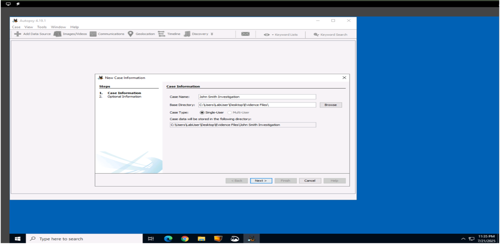
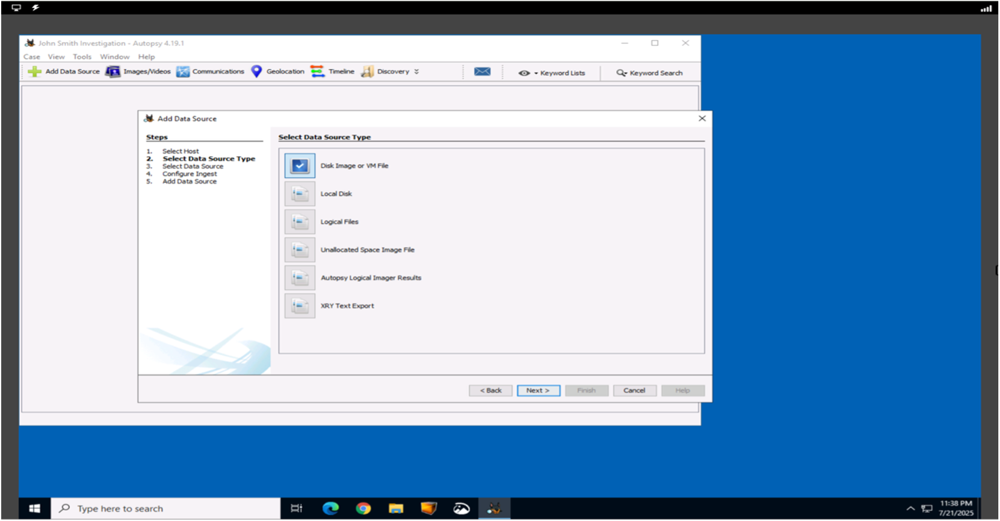
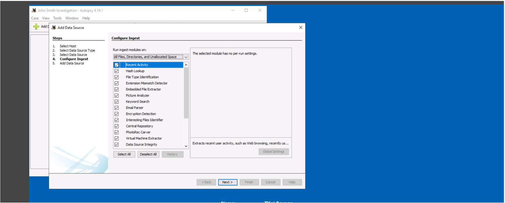
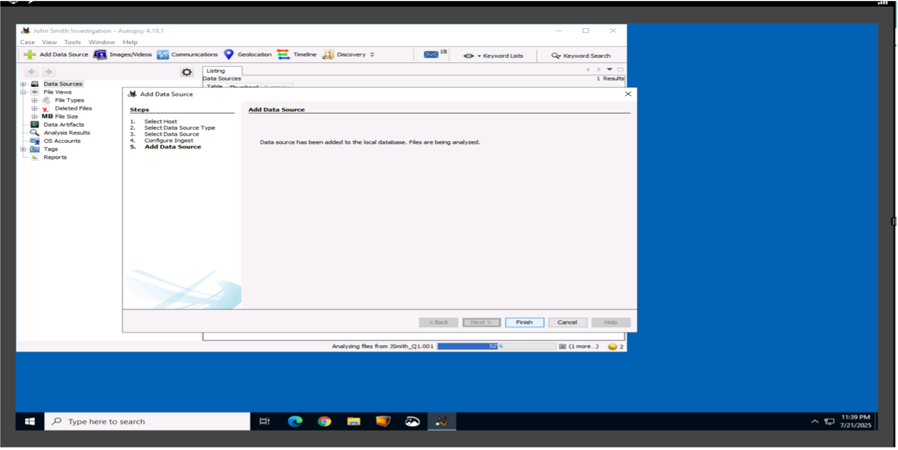
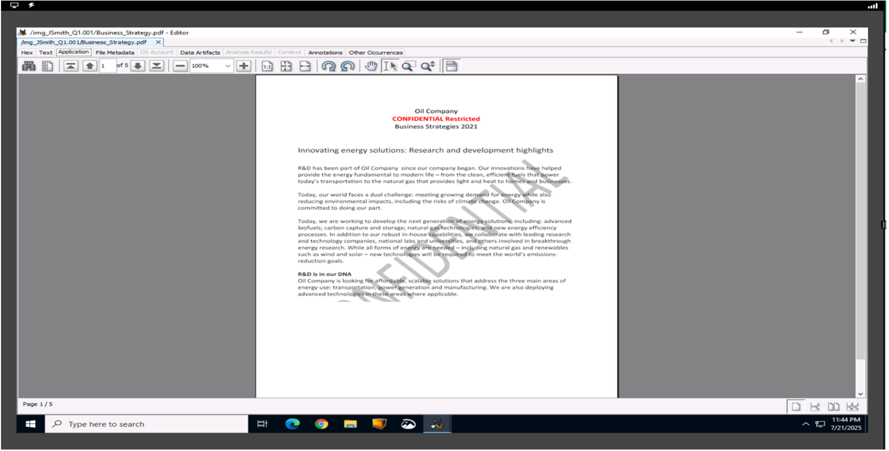
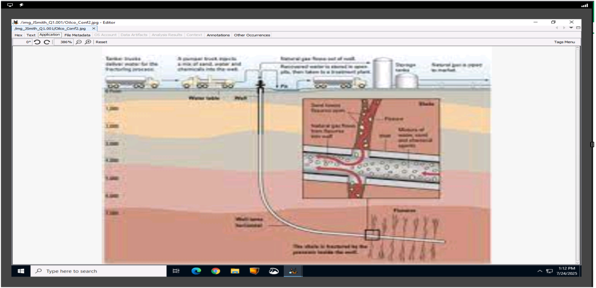
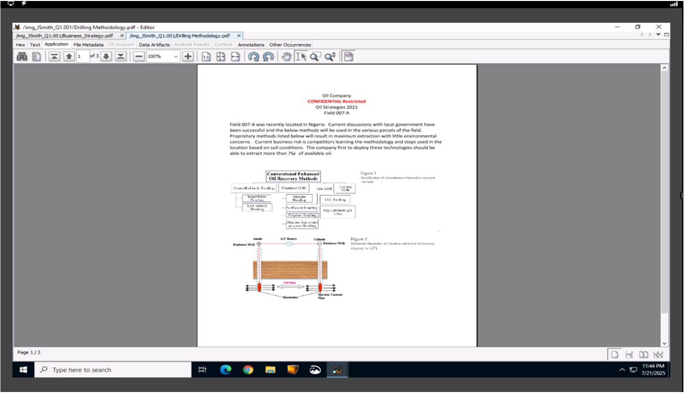
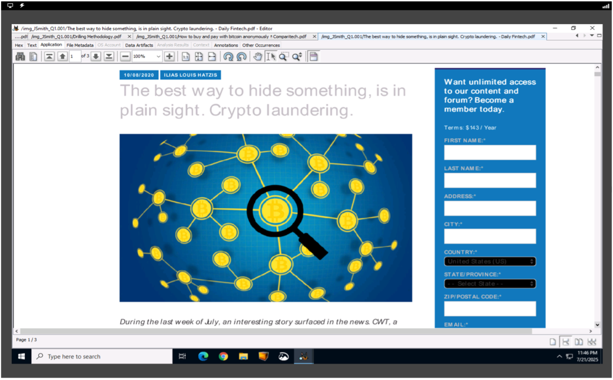

# Insider Threat Digital Forensics Investigation (Autopsy)

Digital forensics investigation of an insider threat using Autopsy
## Executive Summary
This project documents a digital forensics investigation into a suspected insider threat involving unauthorized access to proprietary company information. Senior management and legal counsel authorized a forensic analysis of an employee workstation following concerns of policy violations. A disk image of the system was examined using the Autopsy forensic platform to identify deleted files, user activity artifacts, and indicators of intent. The investigation identified deleted confidential documents and correlated them with suspicious user behavior. Findings were documented and reported to leadership for further review and action.

---
## Incident Background & Authorization
Senior management raised concerns that an employee may have accessed proprietary company information without authorization. The organization maintains strict policies prohibiting the sharing or unauthorized access of confidential data, including signed nondisclosure agreements (NDAs) and acceptable use policies (AUPs). Following these concerns, the legal department approved a digital forensic investigation to determine whether company policy violations occurred. Authorization was granted to examine the employee’s assigned workstation for relevant digital evidence.

---
## Scope & Investigation Plan
The scope of the investigation was limited to the employee’s assigned workstation. The objective was to identify evidence of unauthorized access, storage, deletion, or potential intent to exfiltrate proprietary company data. The investigation focused exclusively on forensic examination of a disk image to preserve evidence integrity. No live system interaction was performed. Analysis was conducted by a single investigator using established digital forensics procedures.

---
## Methodology
The investigation followed a standard digital forensics and incident response (DFIR) methodology aligned with the NIST SP 800-61 incident response lifecycle. The process included identification of the incident, collection of digital evidence, forensic examination of artifacts, analysis and correlation of findings, and formal reporting of conclusions to leadership.

---
## Evidence Acquisition & Preservation
A forensic case was created in Autopsy to analyze a disk image of the suspect workstation. Examiner details, case identifiers, and investigative purpose were documented prior to analysis. The disk image was examined in a read-only state to ensure the integrity of the original evidence was preserved. Autopsy was used to process file systems, unallocated space, and metadata associated with deleted files.

---
## Forensic Analysis & Findings
The forensic examination focused on identifying unauthorized access to proprietary information through file system analysis and user activity artifacts recovered from the disk image.

---

### File System & Deleted File Analysis
Forensic analysis identified multiple files labeled as confidential and restricted that were stored on the suspect’s workstation. Several of these files had been deleted, including documents related to business strategies, drilling methodologies, and oil configurations. The presence of these files suggests unauthorized access to proprietary information outside the employee’s role.

Confidential Document 1

Confidential Document 2

Confidential Document 3

---
### User Activity Artifacts
Analysis of user activity artifacts revealed browser history associated with searches related to anonymous cryptocurrency transactions, including methods to acquire Bitcoin anonymously and avoid detection. These searches were identified during the same timeframe in which proprietary and confidential files were present on the system. This activity was correlated with deleted confidential files and suggests potential intent to conceal or misuse sensitive information.

---

## Analysis & Correlation
The recovery of deleted proprietary documents combined with user browsing activity related to anonymous cryptocurrency transactions suggests an attempt to conceal unauthorized access and potential misuse of sensitive data. The timing and nature of the deleted files, along with correlated user behavior, are consistent with indicators commonly associated with insider threat activity.

---
## Conclusions & Business Impact
The investigation identified indicators of unauthorized access to proprietary company information in violation of established NDAs and acceptable use policies. The potential exposure of confidential business strategies and operational data presents significant financial and competitive risk to the organization. Findings support escalation to senior management and legal counsel to determine appropriate remediation and disciplinary actions.

---
## Tools & Technologies Used
- Autopsy (Digital Forensics Platform)
- Disk Image Analysis
- Windows File System and User Artifact Analysis
